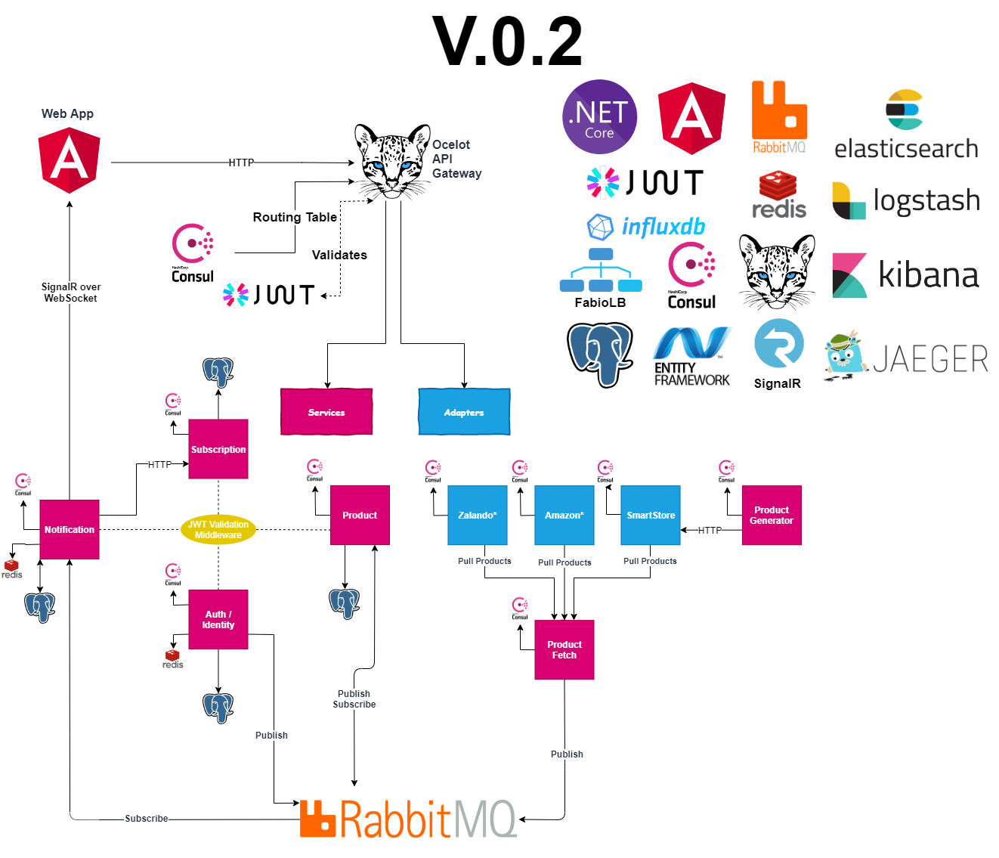
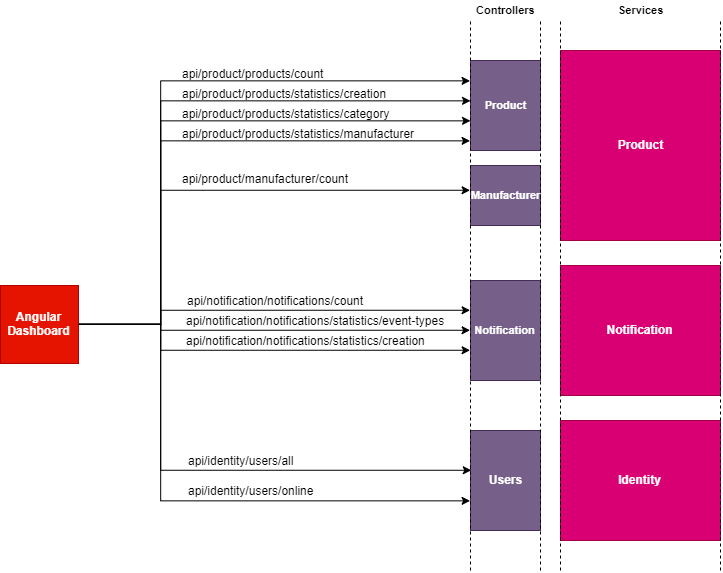
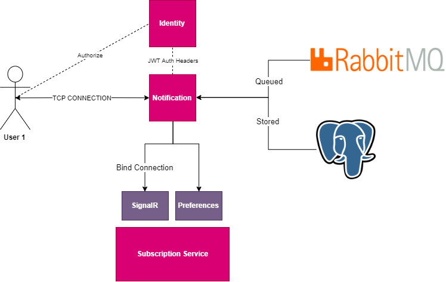
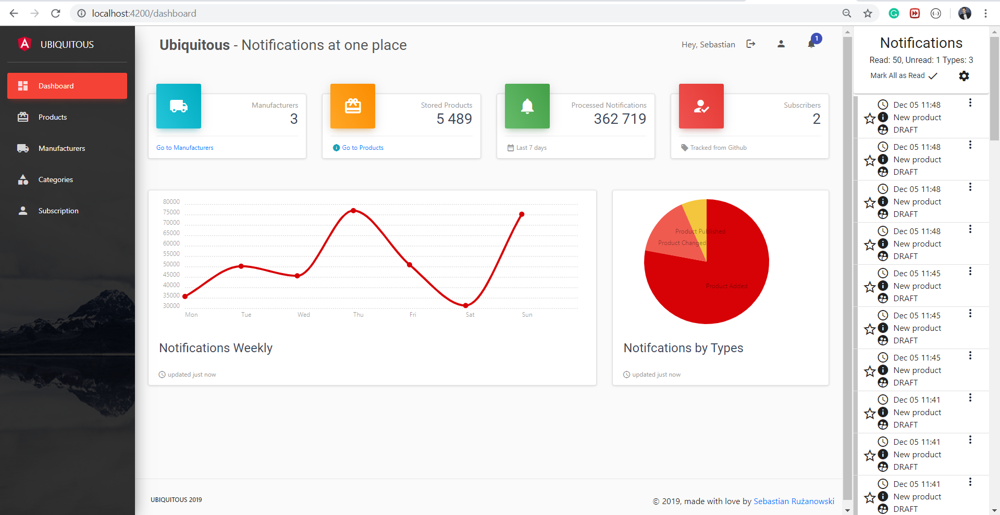
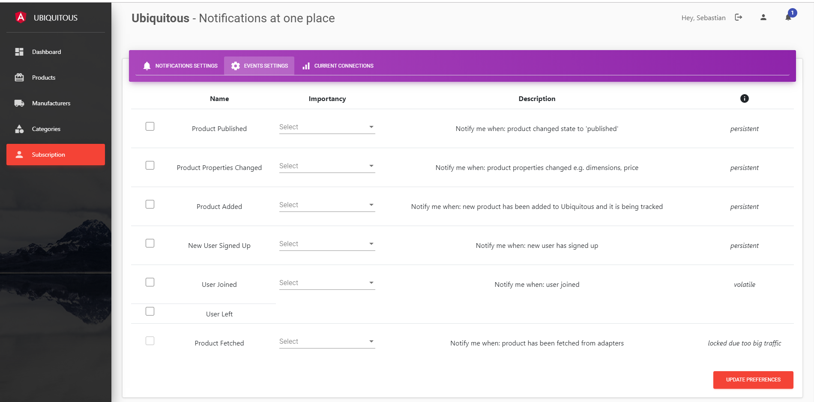
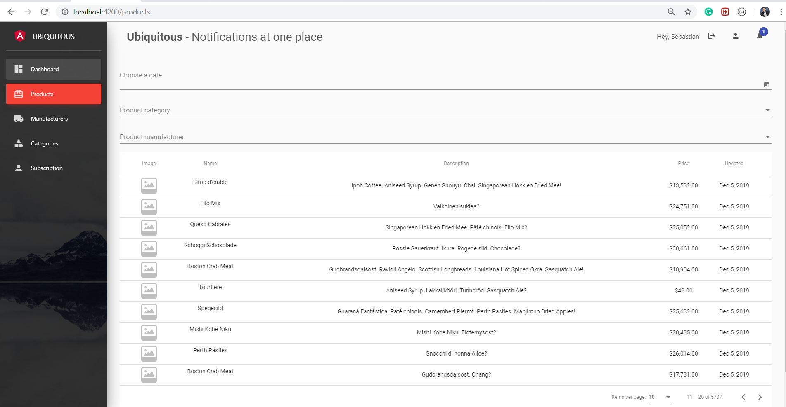
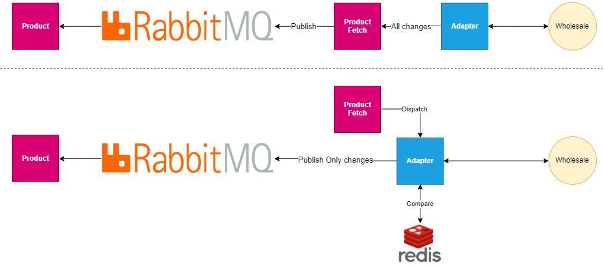

# UBIQUITOUS. Real-Time Notification Manager.
***.NET Core with Angular on microservices.*** <br> 
***Subscribe on **newest state** of your products.***   

- [1. Functionalities](#-1-functionalities)
    - [1.1 Purpose](#11-purpose)
- [2. Server Side Architecture](#1goal-functionalities)
    - [2.1 Technologies And Tools](#21-technologies-and-tools)
    - [2.2 Services](#-22-services)
    - [2.3 Cross-Cutting Concerns](#23-cross-cutting-concerns)
    - [2.4 API - Front communication](#24-api---front-communication)
        - [2.4.1 HTTP](#241-http)
        - [2.4.2 SignalR](#242-signalr)    
    - [2.5 Security](#25-security)
- [3. Client Side Overview](#-3-client-side-overview)
    - [3.1 Client Side technologies and tools](#31-client-side-technologies-and-tools)
- [4. Notification Management](#4-notification-management)
    - [4.1 Handling User Subscriptions](#41-handling-user-subscriptions)
- [5. RoadMap](#5-roadmap)
    - [5.1. Release V.0.2](#51-release-v02)
    - [5.2. Release V.0.3](#52-release-v03)
- [6. Contributing](#6-contributing)
- [7. Author](#7-author)
- [8. Inspirations & Thanks](#8-inspirations--thanks)
- [9. License](#9-license)


| *Master*  | *Develop* |
| --------- | --------- |
| [](https://gitlab.com/Ruzanowski/ubiquitous/commits/master) | [](https://gitlab.com/Ruzanowski/ubiquitous/commits/develop) |
| [](https://gitlab.com/Ruzanowski/ubiquitous/commits/master) | [](https://gitlab.com/Ruzanowski/ubiquitous/commits/develop)

# 1. Introduction

## 1.1. Functionalities
- ***Notifications***
    - Channels
        * [x] signalR (WebSocket)
        * [x] push notification (Toastr)
        * [ ] e-mail
    - Types
        * [x] product published, added, changed
        * [x] user connected, disconnected
    - States
        * [x] trivial, normal, important
    - Persistency
        * [x] PostgreSQL
        * [ ] Elasticsearch _(in tests)_
    - Operations
        * [x] confirmation, hide, remove
        * [x] welcome notifications specified timespan by user preferences
- ***Processing & Capabilities***
    - Distributed processing number of products paralelly among different adapters
- ***Identity & Authorization*** 
    - Ability to _signup, log in, log out, change password_
    - Identification & auth thanks to jwt token across entire system
- ***Admin Management (next versions)*** 
    * [ ] manage products, users, subscriptions
## 1.2 Purpose

- primarily, **self-education** is and was my mmotivation, as well as giving my best around topics like 
     - .NET Core
     - DDD
     - Microservices
     - Docker
     - Angular
     - ...
     - and so much more
- Secondly **most of repositories** I have visited were
    - Relatively small, no possibility to run into performance issues 
    - Easy concerns or well known domain (orders, eShop) or unfinished
    
## 1.3 Install

<details>
<summary>Click to expand!</summary>

1.3.0. Prerequisites
    - Docker
    - Docker composer
    
1.3.1. Run 
```cmd
docker-compose -f docker-compose-infrastructure.yml up
```
1.3.2. Enter localhost:5450 (PGAdmin) and run
```postgresql

CREATE DATABASE "product-service";
CREATE DATABASE "smartstore-adapter";
CREATE DATABASE "fetch-service";
CREATE DATABASE "notification-service";
CREATE DATABASE "subscription-service";
CREATE DATABASE "identity-service";

```

1.3.3. Replace value from file '.env' and row 'RELATIVEPATH' to your relative path indicating folder containing folders with appsettings or adjust them to your preferenes.

1.3.4. Run 

```cmd
docker-compose -f docker-compose-services.yml up
```

1.3.5. You can manage all containers from portainer dashboard.

<p align="center">
   
</p>

</details>
    
## 2. Server Side
Whole solution is broken down to
   - **Frontend** developed with [Angular 7](https://angular.io/)
   - **Backend** developed with  [.NET Core 2.2](https://docs.microsoft.com/en-us/dotnet/core/). 
        - **Services** Functionality-oriented e.g.: products, notifications 
        - **Adapters** Encapsulates shops, wholesales logic and enables communication
        - **Infrastructure**, external libraries listed in []

Down below, a services dependency diagram. See to #3.1 for listed used technologies, tools and their use.
    
<p align="center">
   
</p>

### 2.1 Technologies And Patterns

What you might see in the scope of my project. Things mentioned below are implemented or used, feel free to use and free to contribute.

#### ***V0.1***
- RESTful API implemented in [***ASP.NET Core***](https://docs.microsoft.com/en-us/aspnet/core) 
- [CQRS](https://martinfowler.com/bliki/CQRS.html), [Domain-Driven Design](https://en.wikipedia.org/wiki/Domain-driven_design), [EDA](https://en.wikipedia.org/wiki/Event-driven_architecture) might be found extensively
- Object-Relational Mapping serving easier database connectivity with [***Entity Framework Core***](https://docs.microsoft.com/en-US/ef/core/) 
- [***AutoMapper***](https://github.com/AutoMapper/AutoMapper) & [***MediatR***](https://github.com/jbogard/MediatR), thanks to [Jimmy Bogard](https://github.com/jbogard))
- [***Docker compose***]() (Containers environment)
- Used relational database [***PostgreSql***] & Cache [***Redis***](https://redis.io/)
- CI & CD defined with [***Gitlab DevOps***](https://gitlab.com/)
- Docker stacks created with [***Docker Compose***](https://docs.docker.com/compose/)
- API Gateway wtih [***Ocelot***](https://ocelot.readthedocs.io/) with integrated Service Discovery served by [***Consul***](https://www.consul.io/)
- Websocket push communication (server to client) with [***SignalR***]() with [***Redis***](https://redis.io/) backplane
- [***Polly***](https://github.com/App-vNext/Polly) Resiliency policies
- Message queue [***RabbitMQ***](https://www.rabbitmq.com/) with [***RawRabbit***](https://github.com/pardahlman/RawRabbit) implementation
- HTTP Call [Load Balancing](https://www.citrix.com/glossary/load-balancing.html) between services with [***Fabio***](https://github.com/fabiolb/fabio)

#### ***V0.2***
- Monitoring stack thanks by ELK stack ([***Elasticsearch***](https://www.elastic.co/) [***Logstash***](https://www.elastic.co/) [***Kibana***](https://www.elastic.co/))
- Logging with [***Serilog***](https://serilog.net/), [***Elasticsearch***](https://www.elastic.co/)
- Tracing with [OpenTracing](https://opentracing.io/), [***Jaeger***](https://github.com/jaegertracing/jaeger)
- Metrics with [AppMetrics](https://www.app-metrics.io/), [***Influx***](https://www.influxdata.com/)

### 2.2 Services

**Services**
- ***SmartStore Adapter*** Mock Adapter, source of products ((v.0.3) is going to deprecate this definition, see 5.2) 
- ***Fetch Service*** Fetches data from wholesales(many) and pushes newest items on bus ((v.0.3) is going to deprecate this definition see 5.2) 
- ***Product Service*** Main domain aggregate service, handles products and its business logic
- ***Notification Service*** Handles notifications and channels it by WebSocket
- ***Identity Service*** Handles identity of user and managed Jwt tokens
- ***Subscription Service*** Handles subscriptions of users & preferences for notifications types, channels

### 2.3 Cross-Cutting Concerns

**Modules**
- ***Event Logs*** 
    - Module with connectivity to database, storing event for any integration event dispatched
- ***Event Bus*** 
    - Asynchronous queue shared logic of subscription and publishing typically for RabbitMQ
- ***Common*** 
    - Metrics - [AppMetrics](https://www.app-metrics.io/), [***Influx***](https://www.influxdata.com/)
    - Tracing - [OpenTracing](https://opentracing.io/), [***Jaeger***](https://github.com/jaegertracing/jaeger)
    - Logging - [***Serilog***](https://serilog.net/), [***Elasticsearch***](https://www.elastic.co/)
    - Service Discovery - [***Consul***](https://www.consul.io/)
    - Load Balancing - [***Ocelot***](https://ocelot.readthedocs.io/), [***Fabio***](https://github.com/fabiolb/fabio)
    - Resiliency [***Polly***]()
    - Authentication [***JWT***]()
    - Cache [***Redis***]()
    - Pagination
        
### 2.4 API - Front communication

### 2.4.1 HTTP
UI Dashboard statistics are pull-based calls. Each call returns definite data, sourcing charts, either dashboard cards.  

<p align="center">
   
</p>

### 2.4.2 SignalR

On the right, notification bar is websocket-based. Each notification that falls in the bar, is being managed by signalR. You can operate on notifications. Hide, delete or prioritze.

Every command is pushed to the server via web-socket. Any signalr connectivity failure or 401 http call **results with loggout** and SignalR connection abort.   

<p align="center">
   
</p>
  
### 2.5 Security

_To be determined_

### 2.6 Service Discovery

Each service is self registering to the Consul registry, containing every active service. This registry as well checks healthness of service with optional keep-alive with specified per-service interval.

<p align="center">
   
</p>
        
## 3. Client Side


<p align="center">
   
</p>

<p align="center">
   
</p>

<p align="center">
   
</p>

<p align="center">
   
</p>

### 3.1 Technologies and tools

- Entire web app is written in [***Angular 7***](https://angular.io/) with [Angular Material](https://material.angular.io/), [***Bootstrap*** ](https://getbootstrap.com/)
- Communication is done with  [***Rx.JS***](https://rxjs-dev.firebaseapp.com/) and [***SignalR***]()
- Charts rendered with [***ChartistJS***](https://gionkunz.github.io/chartist-js/) 

## 4. Notification Management

_To be determined_

### 4.1 Handling User Subscriptions

_To be determined_

## 5. RoadMap

| *Task*  | *Priority* |*Status* | *Date* | *Version* |
| ------- | ---------- | ------  | ------ | ------ |
|SmartStore Adapter|-----|Completed|07.2019|V.0.1|
|Fetch Service|-----|Completed|07.2019|V.0.1|
|ProductsGenerator Service|-----|Completed|07.2019|V.0.1|
|Report Service(Caracan Liquid Project) -- Deprecated|-----|Completed|08.2019|V.0.1|
|Dockerization|-----|Completed|09.2019|V.0.1|
|Gitlab CI Pipelines|-----|Completed|09.2019|V.0.1|
|Product Service - Major Features|-----|Completed|10.2019|V.0.1|
|Dashboard Web-Side|-----|Completed|10.2019|V.0.1|
|Notifications SignalR & Basic Features|-----|Completed|10.2019|V.0.1|
|Notifications Management(confirm, hide, remove, mute)|-----|Completed|11.2019|V.0.1|
|Identity Service|-----|Completed|11.2019|V.0.1|
|Jwt Authorization|-----|Completed|11.2019|V.0.1|
|API Gateway|-----|Completed|11.2019|V.0.1|
|Subscriptions Service|-----|Completed|12.2019|V.0.1|
|Notifications new channels (push)|-----|Completed|12.2019|V.0.1|
|Dashboard charts server data sourced|-----|Completed|12.2019|V.0.1|
|Preferences FE-BE Integration|Medium|In Progress| |V.0.1|
|Metrics (App.Metrics + Influx)|-----|Completed|01.2020|V.0.2|
|Tracing (Jaeger)|-----|Completed|01.2020|V.0.2|
|Logging (Serilog + Elasticsearch)|-----|Completed|01.2020|V.0.2|
|ELK stack (Elasticsearch, Logstash, Kibana) integration|Medium|In Progress| |V.0.2|
|Create Adapters Managmenent Service with Observer pattern|High| | |V.0.3|
|Create Adapters with product's change compare functionality on adapters level|High| | |V.0.3|
|Migration to .NET Core 3.1 |Medium||||
|Admin Panel (products)|Medium||||
|Admin Panel (subscribers)|Medium||||
|Notifications by email|Low||||
|Security (HTTPS)|Low||||

### 5.1 Release V.0.2

Release V0.2 brings
+ Heavily extended readme with graphics
+ Elasticsearch, Logstash, Kibana
+ AppMetrics, Influx
+ OpenTracing, Jaeger
+ Serilog with Elasticsearch sink
+ Routing fixes
+ Preferences page fix


### 5.2 Release V.0.3

Release V0.2 scope shall bring

+ Moved major load of determining product's change from Product Service to Adapter
+ Adapters Management Service

<p align="center">
   
</p>

Below diagram depicts change between upper, current (v.0.1, v.0.2) adapters architecture and below (v.0.3) with newest structure and data flow.

<p align="center">
    
</p>


## 6. Contributing
Pull requests are welcome. For major changes, please open an issue first to discuss what you would like to change.

## 7. Author

Sebastian Rużanowski

LinkedIn [https://www.linkedin.com/in/sebastian-ruzanowski](https://www.linkedin.com/in/sebastian-ruzanowski)

GitLab: [https://gitlab.com/ruzanowski](https://gitlab.com/ruzanowski)

## 8. Inspirations & Thanks

- Repositories
    - [DevMentors](https://github.com/devmentors)
    - [Dotnet](https://github.com/dotnet-architecture/eShopOnContainers)
    - [Modular Monolith with DDD](https://github.com/kgrzybek/modular-monolith-with-ddd)
    - [ASC Lab](https://github.com/asc-lab/dotnetcore-microservices-poc) 
- Sites & Blogs
    - [Microservices.io](https://microservices.io/)
    - [Creative Tim](https://www.creative-tim.com/)
    
## 9. License
[MIT](https://choosealicense.com/licenses/mit/)