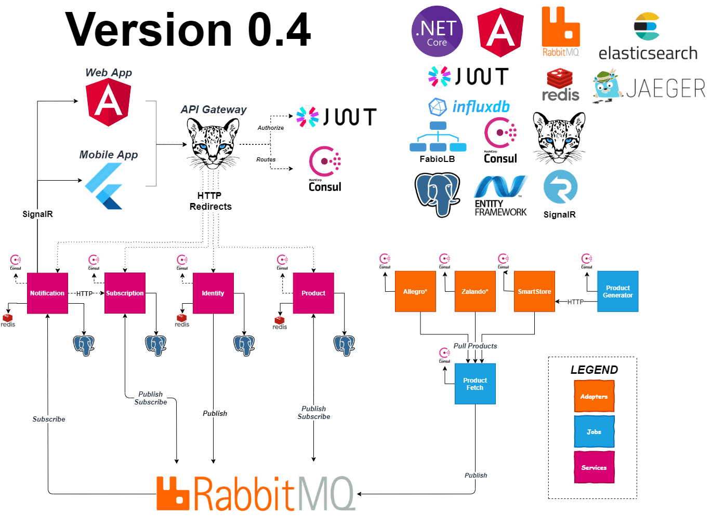
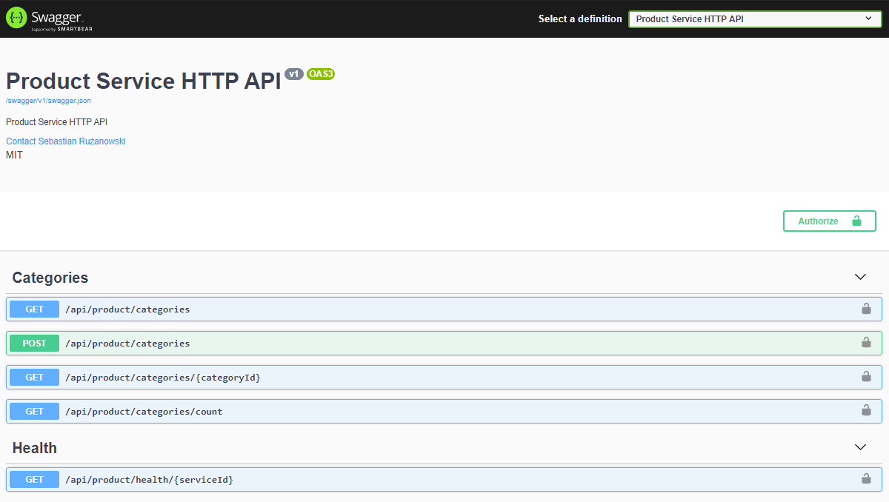
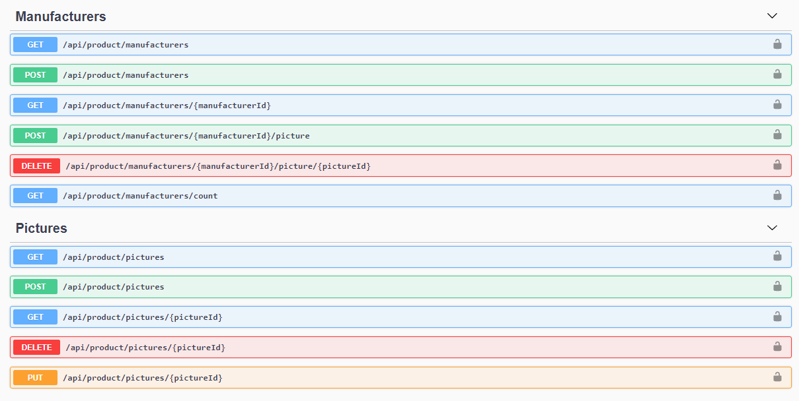
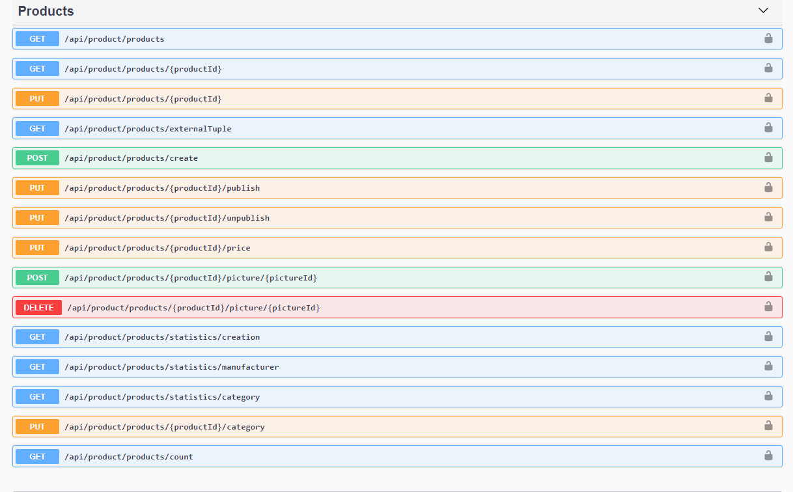
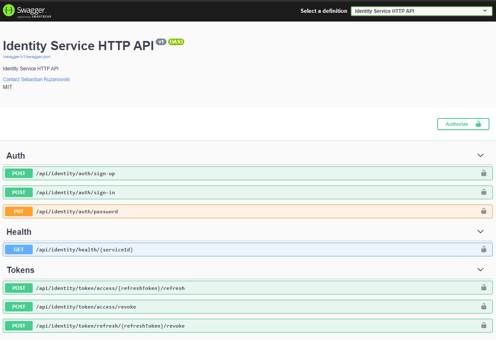
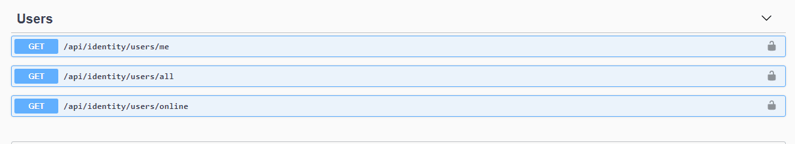
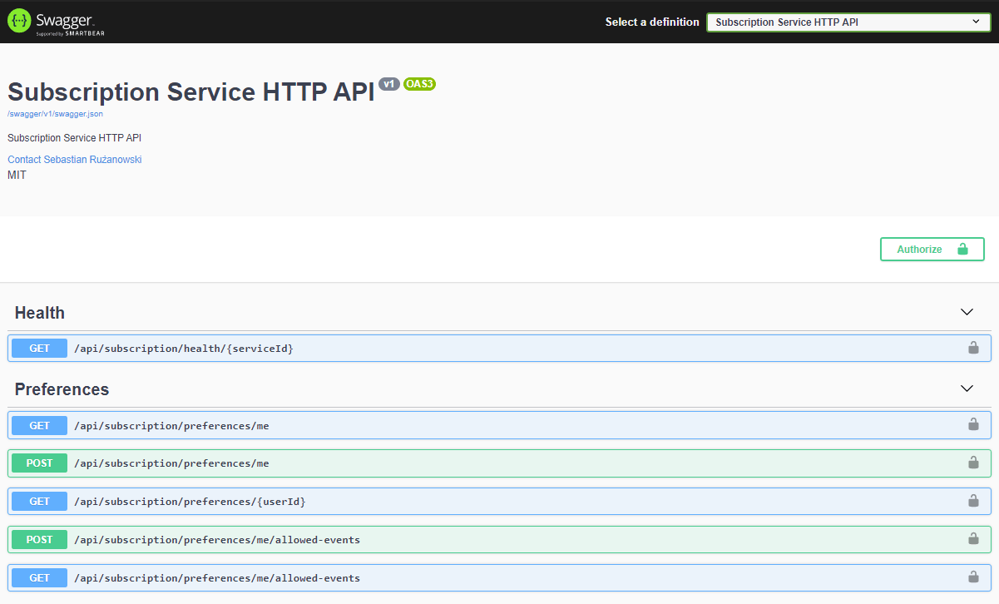
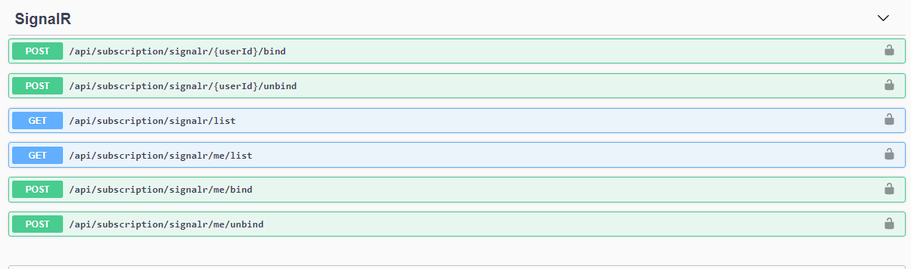
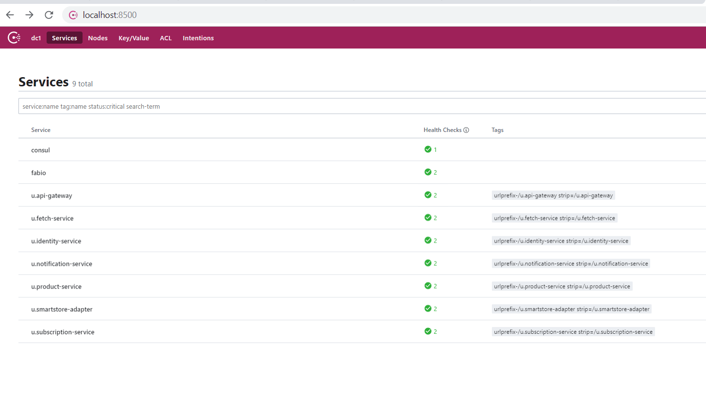
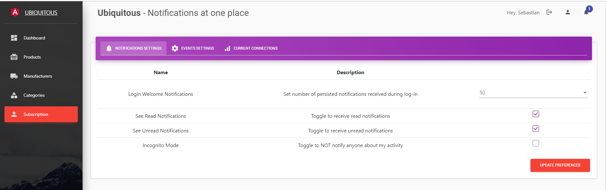

# UBIQUITOUS. Real-Time State & Notification Platform.
.NET Core with Angular on microservices. <br>
Subscribe for **the newest state** of products you follow.

- [1. Introduction](#1-introduction)
    - [1.1 Functionalities](#11-functionalities)
    - [1.2 Purpose](#12-purpose)
    - [1.3 Installation On-Premises](#13-installation-on-premises)
    - [1.4 API Usage](#14-api-usage)
- [2. Server Side](#2-server-side)
    - [2.1 Technologies](#21-technologies)
    - [2.2 Services](#22-services)
    - [2.3 Jobs](#23-jobs)
    - [2.4 Adapters](#24-adapters)
    - [2.5 Cross-Cutting Concerns](#25-cross-cutting-concerns)
    - [2.6 Server-Side Service Discovery](#26-server-side-service-discovery)
- [3. Client Side](#3-client-side)
    - [3.1 Technologies and tools](#31-technologies-and-tools)
- [4. Communication](#4-communication)
    - [4.1 HTTP Protocol](#41-http-protocol)
    - [4.2 WebSocket (SignalR)](#42-websocket-signalr)
    - [4.3 RabbitMQ](#43-rabbitmq)
- [5. RoadMap](#5-roadmap)
    - [5.1. Release V.0.2](#51-release-v02)
    - [5.2. Release V.0.3](#52-release-v03)
    - [5.3. Release V.0.4](#53-release-v04)
- [6. Contributing](#6-contributing)
- [7. Author](#7-author)
- [8. Inspirations & Thanks](#8-inspirations--thanks)
- [9. License](#9-license)

| *Repository*  | *Master*  | *Develop* |
| --------- | --------- | --------- |
| Ubiquitous | [](https://gitlab.com/Ruzanowski/ubiquitous/commits/master) [](https://gitlab.com/Ruzanowski/ubiquitous/commits/master) | [](https://gitlab.com/Ruzanowski/ubiquitous/commits/develop) [](https://gitlab.com/Ruzanowski/ubiquitous/commits/develop) |
| Ubiquitous.Web | [](https://gitlab.com/Ruzanowski/ubiquitous.web/commits/master) [](https://gitlab.com/Ruzanowski/ubiquitous.web/commits/master) | [](https://gitlab.com/Ruzanowski/ubiquitous/commits/develop) [](https://gitlab.com/Ruzanowski/ubiquitous.web/commits/develop)

Repositories:
- [Ubiquitous](https://gitlab.com/Ruzanowski/ubiquitous)
- [Ubiquitous.Web](https://gitlab.com/Ruzanowski/ubiquitous.web)

## 1. Introduction
## 1.1. Functionalities
- ***Notifications***
    - Channels
        * [x] SignalR (WebSocket)
        * [x] Push notification (Toastr)
        * [ ] E-mail
    - Types
        * [x] Product published, added, changed
        * [x] User connected, disconnected
    - States
        * [x] Trivial, normal, important
    - Persistency
        * [x] PostgreSQL
    - Operations
        * [x] Confirmation, hide, remove
        * [x] Welcome notifications specified timespan by user preferences
- ***Processing & Capabilities***
    - Distributed processing number of products paralelly among different adapters
- ***Identity & Authorization***
    - Ability to _signup, log in, log out, change password_
    - Identification & auth thanks to jwt token across entire system
- ***Admin Management (next versions)***
    * [ ] manage products, users, subscriptions
## 1.2 Purpose

- primarily, **self-education** has been my motivation, as well as giving my best around topics like
     - .NET Core
     - DDD
     - Microservices
     - Docker
     - Angular
     - and so much more
- Secondly, I wanted to create something solid, from the beginning to the end and that follows newest patterns and good case practices. On the [GitHub](https://github.com) **most of repositories** I have ever seen were 
    - Relatively small, no possibility to run into performance, integration, authorization issues et cetera
    - Easy concerns or unfinished

## 1.3 Installation On-Premises

<details>
<summary>Click here to expand!</summary>

1.3.0. Prerequisites
    - Docker
    - Docker composer

1.3.1. Run

> build-infra.bat

1.3.2. Enter localhost:5450 (PGAdmin) and run
```postgresql

CREATE DATABASE "product-service";
CREATE DATABASE "smartstore-adapter";
CREATE DATABASE "fetch-service";
CREATE DATABASE "notification-service";
CREATE DATABASE "subscription-service";
CREATE DATABASE "identity-service";

```

1.3.3 Install services
1.3.3a External run e.g. portainer stack
    - Replace environment 'ABSOLUTE_PATH' in '.env' file and indicate folder containing configuration
    - Run >
    > build-services.external.bat
1.3.3b Local run
    - Run
    > build-services.local.bat
1.3.4. Run
```cmd
docker-compose -f docker-compose-services.yml up
```

1.3.5. You can manage all containers from portainer dashboard or through Docker CLI.

<p align="center">
   
</p>

</details>

### 1.4 API Usage

_To be determined_

## 2. Server Side
Whole solution is broken down to
   - **Frontend** developed with [Angular 7](https://angular.io/)
   - **Backend** developed with  [.NET Core 3.1](https://docs.microsoft.com/en-us/dotnet/core/).
        - **Services** Functionality-oriented e.g.: products, notifications
        - **Adapters** Encapsulates shops, wholesales logic and enables communication
        - **Infrastructure**, external libraries listed in []
   - **Solution Files**, there can be found anything like [GitLab CI]() manifesto, [Docker Compose]() yml, starting batch files and other solution configurations.

Down below, a services dependency diagram. See to #3.1 for listed used technologies, tools and their use.

<p align="center">
   
</p>

### 2.1 Technologies

What you might see in the scope of my project. Things mentioned below are implemented or used from legal external sources, feel free to use and to contribute.

#### ***Release V0.1***
- RESTful API implemented in [***ASP.NET Core***](https://docs.microsoft.com/en-us/aspnet/core)
- [***CQRS***](https://martinfowler.com/bliki/CQRS.html), [***Domain-Driven Design***](https://en.wikipedia.org/wiki/Domain-driven_design), [***EDA***](https://en.wikipedia.org/wiki/Event-driven_architecture) might be found extensively
- Object-Relational Mapping serving easier database connectivity with [***Entity Framework Core***](https://docs.microsoft.com/en-US/ef/core/)
- [***AutoMapper***](https://github.com/AutoMapper/AutoMapper) & [***MediatR***](https://github.com/jbogard/MediatR), thanks to [Jimmy Bogard](https://github.com/jbogard))
- [***Docker compose***]() (Containers environment)
- Used relational database [***PostgreSql***] & Cache [***Redis***](https://redis.io/)
- CI & CD defined with [***Gitlab DevOps***](https://gitlab.com/)
- Docker stacks created with [***Docker Compose***](https://docs.docker.com/compose/)
- API Gateway wtih [***Ocelot***](https://ocelot.readthedocs.io/) with integrated Service Discovery served by [***Consul***](https://www.consul.io/)
- Websocket push communication (server to client) with [***SignalR***]() with [***Redis***](https://redis.io/) backplane
- [***Polly***](https://github.com/App-vNext/Polly) Resiliency policies
- Message queue [***RabbitMQ***](https://www.rabbitmq.com/) with [***RawRabbit***](https://github.com/pardahlman/RawRabbit) implementation
- HTTP Calls [***Load Balancing***](https://www.citrix.com/glossary/load-balancing.html) between services with [***Fabio***](https://github.com/fabiolb/fabio)

#### ***Release V0.2***
- Logging with [***Serilog***](https://serilog.net/), [***Elasticsearch***](https://www.elastic.co/)
- Tracing with [***OpenTracing***](https://opentracing.io/), [***Jaeger***](https://github.com/jaegertracing/jaeger)
- Metrics with [***AppMetrics***](https://www.app-metrics.io/), [***Influx***](https://www.influxdata.com/)

### 2.2 Services

**Services**
- ***Product Service*** Handles products and its business logic
    - ***Background Service*** Sends periodically queued commands as batch to improve performance 
- ***Notification Service*** Handles notifications and channels
    - ***Notification Periodic Sender*** Sends periodically notifications, to improve performance
- ***Identity Service*** Handles identity of user and managed Jwt tokens
- ***Subscription Service*** Handles subscriptions of users & preferences, bounces integration events

Product Service            |  Identity Service       |
:-------------------------:|:-------------------------:
    |   


Notification Service             |  Subscription Service
:-------------------------:|:-------------------------:
 |   


### 2.3 Jobs
- ***Generator Service*** Sources SmartStoreAdapter with fake products
- ***Fetch Service*** Sources subscribed ProductService with products related events via RabbitMQ

### 2.4 Adapters
- ***SmartStore Adapter*** Mock Adapter, source of products

### 2.5 Cross-Cutting Concerns

**Building Blocks**
- ***Available on Myget*** [version :develop](https://www.myget.org/feed/Packages/ubiquitous-develop), [version :latest](https://www.myget.org/feed/Packages/ubiquitous)

- ***U.IntegartionEventLog***
    - targets .NET Core 3.1
    - Module with connectivity to database, storing event for any integration event dispatched
- ***U.EventBus***
    - Abstraction of events
- ***U.EventBus.RabbitMQ***
    - Implementation of EventBus with RabbitMQ
- ***Common***
    - targets NETSTANDARD 2.0
    - includes pagination, models shared across projects
- ***Common NetCore***
    - targets .NET Core 3.1
    - Metrics - [AppMetrics](https://www.app-metrics.io/), [***Influx***](https://www.influxdata.com/)
    - Tracing - [OpenTracing](https://opentracing.io/), [***Jaeger***](https://github.com/jaegertracing/jaeger)
    - Logging - [***Serilog***](https://serilog.net/), [***Elasticsearch***](https://www.elastic.co/)
    - Service Discovery - [***Consul***](https://www.consul.io/)
    - API Load Balancing - [***Ocelot***](https://ocelot.readthedocs.io/)
    - Service Mesh Load Balancing [***Fabio***](https://github.com/fabiolb/fabio)
    - Retry Policies [***Polly***]()
    - Authentication [***JWT***]()
    - Cache [***Redis***]() & [***MemoryCache***]()

### 2.6 Server-Side Service Discovery

Each service is self registering to the Consul registry, containing every active service. This registry as well checks healthness of service with optional keep-alive with specified per-service interval.

<p align="center">
   
</p>

## 3. Client Side

Login Page             |  Dashboard
:-------------------------:|:-------------------------:
  |  


Subscription             |  Products
:-------------------------:|:-------------------------:
  |  

### 3.1 Technologies and tools

- Entire web app is written in [***Angular 7***](https://angular.io/) with [***Angular Material***](https://material.angular.io/), [***Bootstrap*** ](https://getbootstrap.com/)
- Communication is done with  [***Rx.JS***](https://rxjs-dev.firebaseapp.com/) and [***SignalR***]()
- Charts rendered with [***ChartistJS***](https://gionkunz.github.io/chartist-js/)

### 4 Communication

Ubiquitous communicates in two ways, synchronous (HTTP) and asynchronous (WebSocket). These two protocols are used for communication between frontend and backend. Check out the table below explaining differences between them.

| *Protocol* | *Communication* | *Architecture* |  *Server Side Transit*  | *Traffic* | *Difficulty* |
| --------- | --------- | --------- | --------- | --------- | --------- |
|WebSocket | asynchronous| Push | indirect, through EventBus | Low | High |
|HTTP | synchronous| Pull | direct | High | Low |


### 4.1 HTTP Protocol
UI Dashboard statistics are pull-based calls. Each call returns definite data, sourcing charts, either dashboard cards.

<p align="center">
   
</p>

### 4.2 WebSocket (SignalR)

On the right, notification bar is websocket-based. Each notification that falls in the bar, is being managed by signalR. You can operate on notifications. Hide, delete or prioritze.

Every command is pushed to the server via web-socket. Any signalr connectivity failure or 401 http call **results with loggout** and SignalR connection abort.

<p align="center">
   
</p>

### 4.3 RabbitMQ

***To be described***

### 5.1 Release V.0.2

Release V0.2 brings
+ Heavily extended readme with graphics
+ Elasticsearch, Logstash, Kibana
+ AppMetrics, Influx
+ OpenTracing, Jaeger
+ Serilog with Elasticsearch sink
+ Routing fixes
+ Preferences page fix

### 5.2 Release V.0.3

Release V.0.3 brings

+ Moved major load of determining product's change from PostgreSQL to Redis
+ Cache added to Notification Service
+ Cache added to Product Service
+ Fixed CI/CD Pipelines extensively
+ Refactored SmartStoreAdapter
+ Identity Service unit tests

### 5.3 Release V.0.4

Release V.0.4 brings

+ Generator Service eligible to modify products in SmartStoreAdapter, then it might generate ProductProperitesChanged and many other events generating in Product Service.
+ Nuget versions straightened up, using CI_Pipeline_IID instead of CI_Pipeline_ID. It is an increment value based on project, instead of global number of the pipeline.
+ Changed versioning to MAJOR.MINOR.REVISION.BUILD from MAJOR.MINOR.BUILD
+ .NET Core 3.1 upgrade
+ Performance boost
+ UTF8 over Newtonsoft JSON serializers
+ Amended Fetch & Generator Services as "Jobs"
+ Get rid of Kibana, Logstash

## 6. Contributing
Pull requests are welcome. For major changes, please open an issue first to discuss what you would like to change.

## 7. Author

Sebastian Rużanowski
You can find me at:
- LinkedIn [https://www.linkedin.com/in/sebastian-ruzanowski](https://www.linkedin.com/in/sebastian-ruzanowski)
- GitLab: [https://gitlab.com/ruzanowski](https://gitlab.com/ruzanowski)
- GitHub: [https://github.com/sebastianruzanowski](https://github.com/sebastianruzanowski)

## 8. Inspirations & Thanks

- Repositories
    - [DevMentors](https://github.com/devmentors)
    - [Dotnet](https://github.com/dotnet-architecture/eShopOnContainers)
    - [Modular Monolith with DDD](https://github.com/kgrzybek/modular-monolith-with-ddd)
    - [ASC Lab](https://github.com/asc-lab/dotnetcore-microservices-poc)
- Sites & Blogs
    - [Microservices.io](https://microservices.io/)
    - [Creative Tim](https://www.creative-tim.com/)

## 9. License
[MIT](https://choosealicense.com/licenses/mit/)