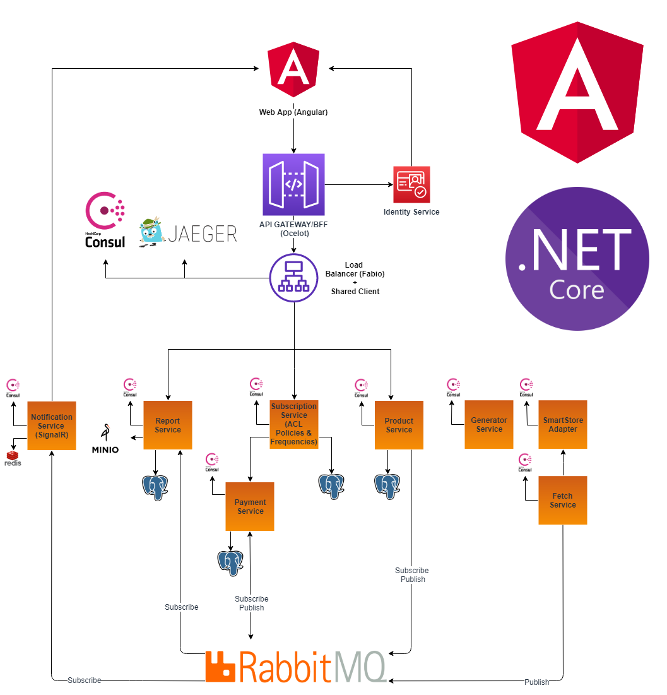

# UBIQUITOUS. Real-Time Notification Manager.
- [x] _Open Source_
- [x] _Distributed Event-Based System with Domain Driven Design approach_
- [x] _Communication served by RabbitMQ & SignalR_


- [1. Functionalities](#-1-functionalities)
    - [1.1 Purpose](#11-purpose)
- [2. Server Side Architecture](#1goal-functionalities)
    - [2.1 Technologies And Tools](#21-technologies-and-tools)
    - [2.2 Services](#-22-services)
    - [2.3 Cross-Cutting Concerns](#23-cross-cutting-concerns)
    - [2.4 API - Front communication](#24-api---front-communication)
    - [2.5 Security](#25-security)
- [3. Client Side Overview](#-3-client-side-overview)
    - [3.1 Client Side technologies and tools](#31-client-side-technologies-and-tools)
- [4. Notification Management](#4-notification-management)
    - [4.1 Handling User Subscriptions](#41-handling-user-subscriptions)
- [5. RoadMap](#5-roadmap)
- [6. Contributing](#6-contributing)
- [7. Author](#7-author)
- [8. Inspirations & Thanks](#8-inspirations--thanks)
- [9. License](#9-license)


| *Master*  | *Develop* |
| --------- | --------- |
| [](https://gitlab.com/Ruzanowski/ubiquitous/badges/master/build.svg) | [](https://gitlab.com/Ruzanowski/ubiquitous/badges/develop/build.svg)


# 1. Introduction

## 1.1. Functionalities
- ***Notification management*** 
    - Channels
        * [x] SignalR (WebSocket)
        * [ ] Push notification (Toastr)
        * [ ] E-mail
    - Types
        * [x] product published
        * [x] product added
        * [x] product properties changed
    - Operations
        * [ ] auto-confirmation
        * [ ] hide notification
        * [ ] remove notification
        * [ ] silence type of notification
-  ***Notifications persistency*** 
    * [x] each notification and subscribers state are persisted in PostgreSQL
    * [x] welcome notifications are sent from last 24hrs for first log-in
- ***admin management (next versions)*** 
    - Operations 
        * [ ] manage products and its details thru product service API
        * [ ] manage users subscriptions
        * [ ] manage subscribers notifications

## 1.2 Purpose
- **prime goal** is/was an education and giving my best around programming topics like 
     - .NET Core
     - Microservices
     - Docker
     - DDD
     - Angular
     - ...
     - and so much more
- Secondly **most of repositories** I have visited were
    - Relatively small, no possibility to run into issues of performance
    - Easy concerns or well known domain (orders, eShop)
    - Unfinished
    
## 1.3 Install

####1.3.0. Prerequisites

    - Docker
    - Docker composer
    
####1.3.1. Run 
```cmd
docker-compose -f docker-compose-infrastructure.yml up
```
####1.3.2. Enter localhost:5450 (PGAdmin) and run
```postgresql
CREATE DATABASE product-service;
CREATE DATABASE smartstore-adapter;
CREATE DATABASE fetch-service;
CREATE DATABASE notification-service;
```

####1.3.3. Replace value from file '.env' and row 'RELATIVEPATH' to your relative path indicating folder containing folders with appsettings or adjust them to your preferenes.

####1.3.4. Run 

```cmd
docker-compose -f docker-compose-services.yml up
```

####1.3.5. You can manage all containers from portainer dashboard.

<p align="center">
   
</p>
    
## 2. Server Side Architecture
Whole solution is designed and broken down to
   - **Frontend** is (being) implemented  in **Angular 7** with **Angular Material** as UI component infrastructure and Material Design components.
   - **Backend** is (being) written in **.NET Core 2.2**(current stable version). 

Down below, a services dependency diagram. See to #3.1 for listed used technologies, tools and their use.
    
<p align="center">
   
</p>

### 2.1 Technologies And Tools
- ***EF Core 2.2*** *(ORM)*
- ***RabbitMQ*** *(Service-service communication)*
- ***Consul*** *(Service discovery, keep alive)*
- ***Fabio*** *(Load balancer)*
- ***MediatR*** *(CQRS pattern dispatch)*
- ***Docker*** *(Containers environment)*
- ***Polly*** *(Resiliency policies)*
- ***Serilog*** *(Logging)*
- ***AutoMapper*** *(Objects mappings)*
- ***PostgreSql*** *(Database)*
- ***Gitlab DevOps*** *(CI)*
- ***SignalR*** *(Asynchronous communication, Notifications)*
- ***Redis*** Distributed caching & SignalR backplane

- ***Ocelot*** [todo] API Gateway
- ***Jaeger*** [todo] Tracing
- ***Grafana*** [todo] Metrics
- ***Prometheus*** [todo] Metrics infrastructure

### 2.2 Services
-------
**Services**
- ***SmartStore Adapter*** Wholesale, source of data
- ***Fetch Service*** Fetches data from wholesales(many) and pushes newest items on bus
- ***Product Service*** Main domain aggregate service, handles products and its business logic
- ***Report Service*** Handles reports and its generation thanks to [Caracan](https://github.com/caracan-team)
- ***Notification Service*** Handles notifications and channels it by WebSocket
-------
### 2.3 Cross-Cutting Concerns

**Modules**
- ***IntegrationEvent Log*** 
    - Persistent Module with shared Unit Of Work logic for integration events for UDP-like communication
- ***EventBus RabbitMQ*** 
    - RabbitMQ asynchronous queue shared logic of subscription and publishing
- ***Common*** 
    - Shared logic
        - Tracing (Jaeger)
        - Logging (Serilog)
        - Service Discovery (Consul)
        - Load Balancing (Fabio)
        - Resiliency (Polly)
        - Pagination
        
### 2.4 API - Front communication

_To be determined_
  
### 2.5 Security

_To be determined_
        
## 3. Client Side Overview

<p align="center">
   
</p>

### 3.1 Client Side technologies and tools
- ***Angular 7***
- ***Angular Material*** 
- ***RxJS***
- ***ASPNET SignalR***

## 4. Notification Management

_To be determined_


### 4.1 Handling User Subscriptions

_To be determined_

## 5. RoadMap

| *Task*  | *Priority* |*Status* | *Date* |
| ------- | ---------- | ------  | ------ |
|SmartStore Adapter|-----|Completed|07.2019|
|Fetch Service|-----|Completed|07.2019|
|ProductsGenerator Service|-----|Completed|07.2019|
|Report Service(Caracan Liquid Project)|-----|Completed|08.2019|
|Dockerization|-----|Completed|09.2019
|Gitlab CI Pipelines|-----|Completed|09.2019
|Product Service - Major Features|Critical|Completed|10.2019|
|Dashboard Web-Side| Critical|Completed|10.2019|
|Notifications SignalR & Basic Features|Critical|Completed|10.2019|
|Notifications Management(confirm, hide, remove, mute)|Critical|In Progress||
|Identity Service|Critical|||
|Security (HTTPS)|High|||
|Ocelot|High|||
|Notifications new channels (push, e-mail)|Medium||
|Tracing (Jaeger)|Medium|||
|Admin Web-Side Panel (products)|Medium|||
|Admin Web-Side Panel (subscribers, users)|Medium|||
|Notification by E-mail| Medium||
|Migration to .NET Core 3.0 |Low|||

## 6. Contributing
Pull requests are welcome. For major changes, please open an issue first to discuss what you would like to change.

## 7. Author

Sebastian Rużanowski

LinkedIn [https://www.linkedin.com/in/sebastian-ruzanowski](https://www.linkedin.com/in/sebastian-ruzanowski)

GitLab: [https://gitlab.com/Ruzanowski](https://gitlab.com/Ruzanowski)

## 8. Inspirations & Thanks

- Repositories
    - [DevMentors](https://github.com/devmentors)
    - [Dotnet](https://github.com/dotnet-architecture/eShopOnContainers)
    - [Modular Monolith with DDD](https://github.com/kgrzybek/modular-monolith-with-ddd)
    - [ASC Lab](https://github.com/asc-lab/dotnetcore-microservices-poc) 
- Sites & Blogs
    - [Microservices.io](https://microservices.io/)
    
## 9. License
[MIT](https://choosealicense.com/licenses/mit/)